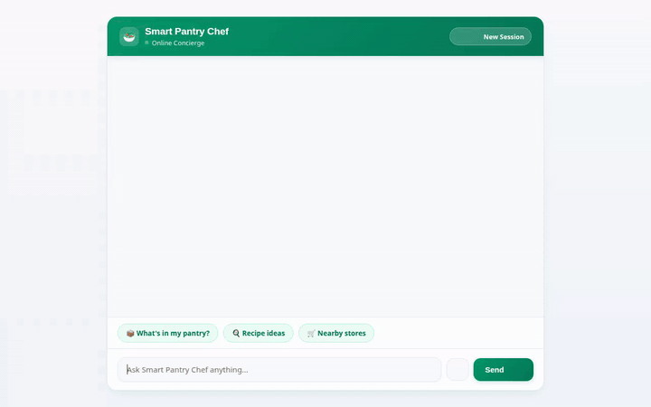

# Smart Pantry Chef 🥗

> A conversational AI concierge that helps home cooks manage pantry inventory, discover recipes grounded in available ingredients, generate AI food photography and videos, and locate nearby grocery stores.



---

## 🌟 Overview

**Smart Pantry Chef** is an AI agent built with Google's Agent Development Kit (ADK) and Gemini models. It connects real-time database tracking (Google Cloud Firestore) with recipe search, generative AI media creation, local map location services, and adaptive UI rendering (A2UI).

---

## 🛠️ Implemented Capabilities & Tools

Every feature listed below is fully implemented and wired up in `app/agent.py` and `agents-cli-manifest.yaml`:

### 📦 1. Firestore Pantry Management
- **`get_pantry_items(category)`**: Queries real-time inventory from the Google Cloud Firestore `pantry` collection, with optional category filtering (e.g., *Meat*, *Produce*, *Pantry*, *Dairy*).
- **`add_or_update_pantry_item(item_name, quantity, unit, category, expiration_date)`**: Adds or updates pantry items, quantities, units, and expiration dates directly in Firestore.

### 🍳 2. Recipe Discovery
- **`search_recipes(ingredients, max_prep_time_minutes)`**: Searches local curated recipe catalog matching available pantry ingredients and time constraints.
- **`fetch_online_recipes(query)`**: Fetches live global recipes, instructions, and ingredients from **TheMealDB** API.

### 🎨 3. AI Media Generation & Cloud Storage
- **`generate_dish_image(dish_name)`**: Generates professional food photography previews using Vertex AI's `gemini-3.1-flash-lite-image` model. Saves session artifacts and uploads directly to a public **Google Cloud Storage (GCS)** bucket (`gs://smart-pantry-chef-media-*`).
- **`generate_dish_video(dish_name)`**: Generates culinary demonstration videos using Vertex AI's `gemini-omni-flash-preview` model via the Interactions API, saving session artifacts and returning public GCS media URLs.

### 🗺️ 4. Google Maps & Location Services
- **`geocode_address(address)`**: Converts street addresses or city names into geographic coordinates using the **Google Geocoding API**.
- **`find_nearby_places(latitude, longitude, place_type, radius_meters)`**: Discovers nearby supermarkets, grocery stores, and bakeries using the **Google Places API (New)**.

### 🧠 5. Context & Cross-Session Memory
- **Vertex AI Memory Bank**: Integrates `VertexAiMemoryBankService` and `PreloadMemoryTool` (`after_agent_callback`) to remember user dietary preferences, household food allergies, and cooking skill levels across sessions.

### 📱 6. Adaptive UI (A2UI) & Execution Sandbox
- **A2UI Schema Manager (v0.8)**: Generates structured, responsive UI cards, columns, rows, text, and image components via `a2ui_callback`.
- **Agent Engine Sandbox**: Executes Python code blocks via `AgentEngineSandboxCodeExecutor` for custom mathematical and unit conversion tasks.

---

## ☁️ Google Cloud Services Integrated

- **Google Cloud Firestore**: Real-time database for pantry inventory tracking.
- **Google Cloud Storage (GCS)**: Public media hosting for AI-generated food images and culinary videos.
- **Vertex AI Platform**:
  - `gemini-flash-latest`: Core LLM reasoning engine.
  - `gemini-3.1-flash-lite-image`: AI food photo generation.
  - `gemini-omni-flash-preview`: AI culinary video generation.
  - **Vertex AI Memory Bank**: Long-term conversational memory.
  - **Agent Engine Sandbox**: Secure Python execution environment.
- **Google Maps Platform**: Geocoding API and Places API (New).

---

## 📋 Planned / Not Yet Implemented

The following features were outlined in initial concept briefs but are not currently implemented in the codebase:
- ❌ **Barcode / Receipt Camera Scanner**: Automated image OCR to ingest grocery receipts into Firestore (*planned, not yet implemented*).
- ❌ **Automated Cart Checkout**: Direct integration with supermarket online ordering services (*planned, not yet implemented*).

---

## 🚀 Local Setup & Running Instructions

### Prerequisites
1. **Python 3.11+** and [`uv`](https://docs.astral.sh/uv/) package manager installed.
2. **Google Cloud SDK (`gcloud`)** authenticated with active project access.
3. Environment variables configured in `.env` or current environment:
   ```bash
   export GOOGLE_GENAI_USE_VERTEXAI=true
   export GOOGLE_MAPS_API_KEY="your-google-maps-api-key"
   ```

### Installation
Install `google-agents-cli` and project dependencies:
```bash
uv tool install google-agents-cli
agents-cli install
```

### Running Locally
To launch the agent locally with auto-reloading development server:
```bash
agents-cli playground
```

Or run the local web server directly:
```bash
uv run python main.py
```

---

## 🧪 Testing & Evaluation

Run unit and integration tests:
```bash
uv run pytest tests/unit tests/integration
```

Run agent evaluation suite:
```bash
agents-cli eval
```
